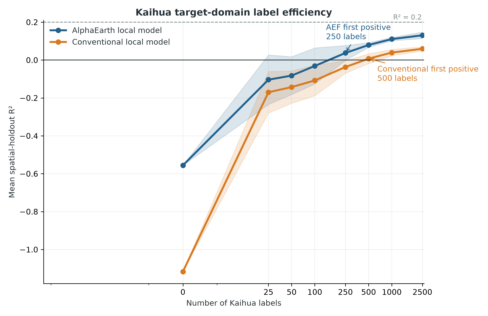
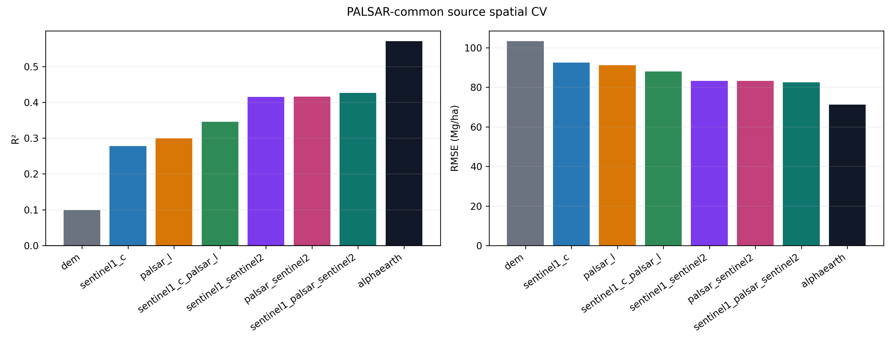
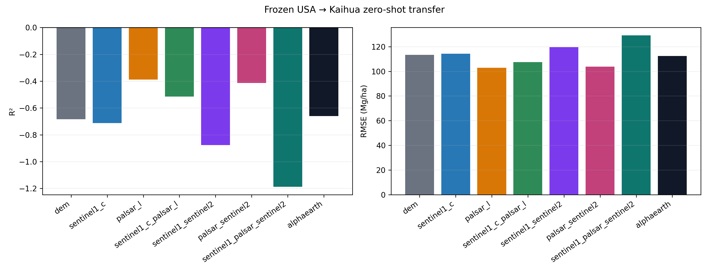
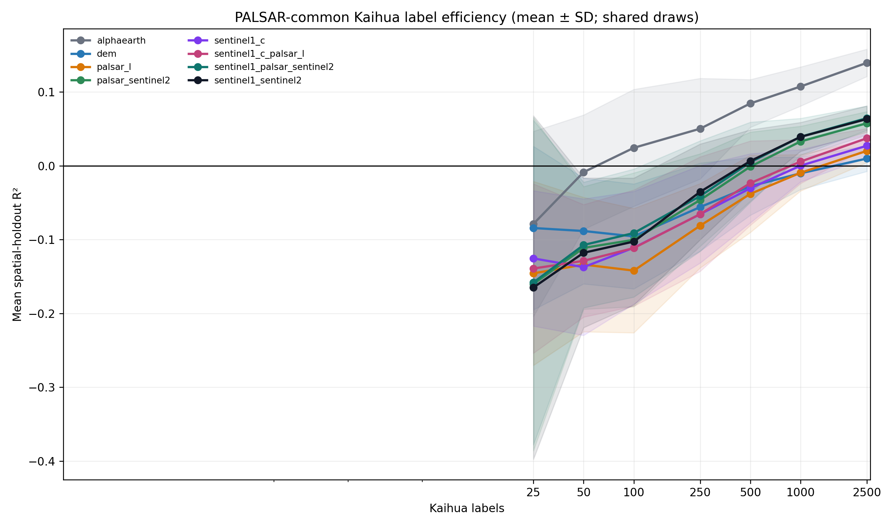

# Cross-Region Forest Biomass Estimation with GEDI, AlphaEarth, C-band and L-band SAR

Can annual **AlphaEarth** embeddings transfer GEDI L4A biomass relationships from the
southeastern United States to eastern China **better, and with fewer local labels**,
than conventional Sentinel-1 / Sentinel-2 features? The version-2 extension also
tests a paired **C-band vs L-band radar representation benchmark** using Sentinel-1
and ALOS-2 PALSAR-2.

## Overview

GEDI provides globally distributed footprint estimates of forest structure and
aboveground biomass density (AGBD), but its sampling is sparse. Continuous
Earth-observation predictors can extend relationships learned at GEDI footprints,
yet it is unclear whether those relationships remain valid across major geographic
and ecological shifts.

This project asks a single, narrow question:

> Do AlphaEarth embeddings transfer GEDI biomass relationships from the
> southeastern United States to Kaihua County, China, better—and with fewer
> local labels—than conventional Sentinel-1/Sentinel-2 features?

The work separates three questions that are often conflated: **source-domain
prediction**, **direct geographic transfer**, and **target-domain label
efficiency**. AlphaEarth improved the first and third, but severe USA-to-Zhejiang
domain shift prevented reliable zero-shot prediction, so the project reports a
restricted positive result rather than an operational map.

## Key results

### Original experiment — `legacy_frozen_experiment`

R² = coefficient of determination; RMSE = root-mean-square error (Mg/ha); AGBD =
aboveground biomass density. All values are frozen and reproduced from
`outputs/tables/main_results/`. Different rows use different evaluation settings and
should not be compared as if they were the same experiment.

| Evaluation setting | AlphaEarth + DEM | Conventional + DEM |
|---|---:|---:|
| USA source spatial-CV R² | 0.576 | 0.425 |
| USA source spatial-CV RMSE (Mg/ha) | 69.11 | 80.49 |
| Kaihua zero-shot R² (labels locked) | −0.556 | −1.117 |
| Labels to first positive local-model R² | 250 | 500 |
| Kaihua local-model R² at 2,500 labels | 0.131 ± 0.017 | 0.059 ± 0.011 |

The zero-shot rows are a **negative result**: both frozen USA models failed in
absolute terms on the target. AlphaEarth kept a consistent relative advantage and
required fewer target labels to recover positive spatial-holdout performance, but
**no method reached mean R² = 0.20**, so this is not an operational biomass map.

### Radar wavelength/sensor extension — `palsar_common_paired_benchmark`

The extension is an additional benchmark layer; it does not replace or silently
recompute the table above. It compares DEM, Sentinel-1 C-band, PALSAR-2 L-band,
C+L fusion, S1+S2, PALSAR+S2, S1+PALSAR+S2 and AlphaEarth on identical rows.

PALSAR uses `JAXA/ALOS/PALSAR/YEARLY/SAR_EPOCH`, the central 25 m pixel, land QA
(`qa=255`), and `20*log10(DN)-83` after masking nonpositive DN. RFDI is computed
from linear power. Angle, epoch/acquisition date and QA are retained only for QC.

**Completed benchmark (2026-08-21):** the availability audit froze common years
2019, 2020, 2021, 2022 and 2024. Kaihua had no `qa=255` footprint in the 2023
mosaic, so 2023 was excluded without nearest-year substitution. The identical-row
benchmark contains 91,526 source and 102,315 target footprints.

| Representation | Source CV R² | Source RMSE | Kaihua zero-shot R² | Zero-shot RMSE |
|---|---:|---:|---:|---:|
| DEM | 0.099 | 103.35 | −0.684 | 113.25 |
| S1_C | 0.278 | 92.52 | −0.713 | 114.22 |
| PALSAR_L | 0.299 | 91.14 | **−0.388** | **102.79** |
| S1_C + PALSAR_L | 0.346 | 88.05 | −0.515 | 107.42 |
| S1 + S2 | 0.415 | 83.23 | −0.876 | 119.53 |
| PALSAR + S2 | 0.416 | 83.17 | −0.413 | 103.73 |
| S1 + PALSAR + S2 | 0.426 | 82.44 | −1.187 | 129.06 |
| AlphaEarth | **0.571** | **71.31** | −0.661 | 112.45 |

PALSAR improved on S1 in every source fold (mean ΔR² +0.021; ΔRMSE
−1.38 Mg/ha). C+L fusion improved source prediction over either radar alone, but
did not improve zero-shot transfer over PALSAR alone. Holding S2+DEM approximately
constant, source performance was effectively tied, while PALSAR+S2 transferred
less poorly. All zero-shot R² values remained negative. In few-shot spatial
holdout, AlphaEarth first became positive at 100 labels; the full conventional
branches at 500; S1, PALSAR+S2 and C+L at 1,000; and PALSAR alone at 2,500.
No representation reached mean R² 0.20, so wall-to-wall mapping was withheld.








## Method summary

- **Study areas.** Source: Georgia and South Carolina (consistent state boundaries).
  Target: Kaihua County, Zhejiang (administrative code 330824), frozen before
  evaluation.
- **Data.** GEDI L4A AGBD (2019–2024); AlphaEarth `GOOGLE/SATELLITE_EMBEDDING/V1/
  ANNUAL` (A00–A63); Sentinel-1 GRD and Sentinel-2 SR Harmonized; Copernicus
  GLO-30 DEM. GEDI L4A AGBD is the downstream response product, not field truth.
- **Feature construction.** AlphaEarth: exact-year central 10 m pixel.
  Conventional: exact-year annual-median Sentinel-1/Sentinel-2 plus DEM. Longitude
  and latitude are metadata only, never predictors.
- **Sampling & validation.** Source: 50 km spatial blocks, block × year strata,
  deterministic seed 42, cap 200 per stratum, no AGBD balancing, no
  target-informed sampling → 124,303 common samples after DEM masking. Target:
  117 fixed 5 km × 5 km grid cells in EPSG:32650 assigned whole to five sample-balanced spatial folds (~26,000 footprints each); shared label draws, seeds 42–44.
- **Models.** Identical restricted source-only tuning budget for both
  representations, with the configuration chosen by nested spatial cross-validation;
  target model selection forbidden.
- **Evaluation metrics.** R², RMSE, MAE, Bias (Mg/ha); domain diagnostics (PCA,
  logistic classifier AUROC, nearest-embedding distance vs error).
- **Radar extension.** Availability is audited first; all representations are rerun
  on one frozen PALSAR-common sample with shared folds/model budgets. Kaihua labels
  remain inaccessible until zero-shot prediction hashes are frozen.


Full detail: [`docs/methodology.md`](docs/methodology.md),
[`docs/experiments.md`](docs/experiments.md),
[`docs/validation.md`](docs/validation.md), and
[`docs/technical_report.md`](docs/technical_report.md).

## Repository structure

```text
gedi-alphaearth-biomass/
├── README.md
├── LICENSE
├── CITATION.cff
├── requirements.txt / environment.yml
├── config.yaml                 # frozen experiment configuration
├── scripts/
│   ├── 01_data_extraction/     # GEE export and direct download
│   ├── 02_data_preparation/    # finalize, QA, freeze, fold design
│   ├── 03_modeling/            # train, zero-shot, few-shot
│   ├── 04_diagnostics/         # domain shift + figures
│   ├── utilities/              # leakage guards
│   └── README.md               # script → stage map
├── figures/                   # publication-style result figures
├── outputs/
│   ├── tables/
│   │   ├── main_results/       # the four headline tables
│   │   ├── diagnostics/        # per-experiment diagnostic tables
│   │   └── audits/             # QA and audit tables
│   └── manifests/              # frozen designs, folds, seeds, SHA-256
├── docs/
│   ├── methodology.md
│   ├── experiments.md
│   ├── validation.md
│   ├── technical_report.md
│   └── reproduction.md
└── data/
    └── README.md              # data sources, licensing, how to obtain
```

## Quick start

```bash
git clone https://github.com/raccoon663/gedi-alphaearth-biomass.git
cd gedi-alphaearth-biomass
python -m venv .venv && source .venv/bin/activate
pip install -r requirements.txt
```

The **result tables, figures, and frozen manifests are included**, so the
conclusions can be inspected without any download. To re-run the pipeline end to end,
see [`scripts/README.md`](scripts/README.md) and
[`docs/reproduction.md`](docs/reproduction.md). That path requires a Google Earth
Engine account (`earthengine authenticate`); the extraction scripts call
`ee.Initialize()` and reference only public asset IDs.

## Data availability

Raw and processed remote-sensing data are **not** in this repository (volume,
redistribution terms, Earth-Engine workflow). See
[`data/README.md`](data/README.md) for dataset names, time spans, sources,
licensing posture, and how to regenerate local inputs. Target validation uses GEDI
L4A footprint estimates, not independent field plots; no restricted or third-party
data is distributed here. Per-sample manifests that carry GEDI shot IDs or
coordinates are excluded from the repository, while frozen designs, folds, seeds, and
SHA-256 checksums remain so the experiment can be verified without them.

## Limitations

- GEDI L4A is not field-measured biomass truth; target evaluation also uses GEDI
  L4A. No independent Chinese field plots were available.
- AlphaEarth pretraining includes GEDI L2A relative-height information — GEDI-derived
  structural provenance overlap, not direct downstream AGBD label leakage (see
  [`docs/methodology.md`](docs/methodology.md) for the source).
- 5 km target block CV reduces but does not eliminate ecological dependence among
  neighbouring blocks.
- Only one source geography and one Chinese target region were tested.
- Few-shot adaptation used one fixed lightweight model, not extensive target
  hyperparameter search.
- Absolute Kaihua performance remained too weak for a reliable operational biomass
  map; wall-to-wall mapping was not pursued.
- Sentinel-1 and PALSAR-2 also differ in polarization, geometry, acquisition
  strategy, temporal sampling and preprocessing. This is a sensor/wavelength
  representation benchmark, not a perfectly controlled wavelength experiment.
- PALSAR yearly mosaics are not temporally equivalent to Sentinel-1 annual medians;
  epoch timing is audited but excluded from primary predictors.
