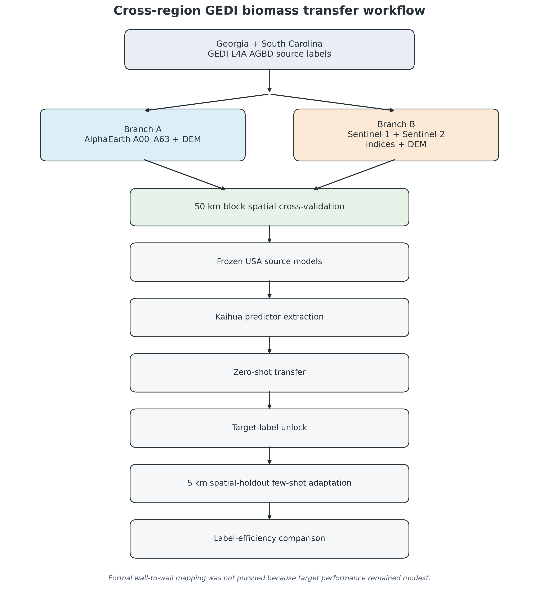
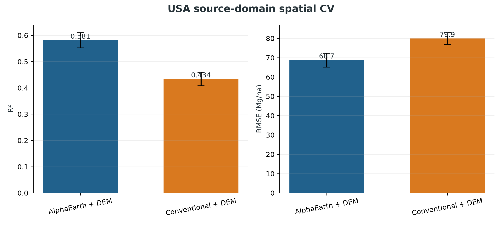
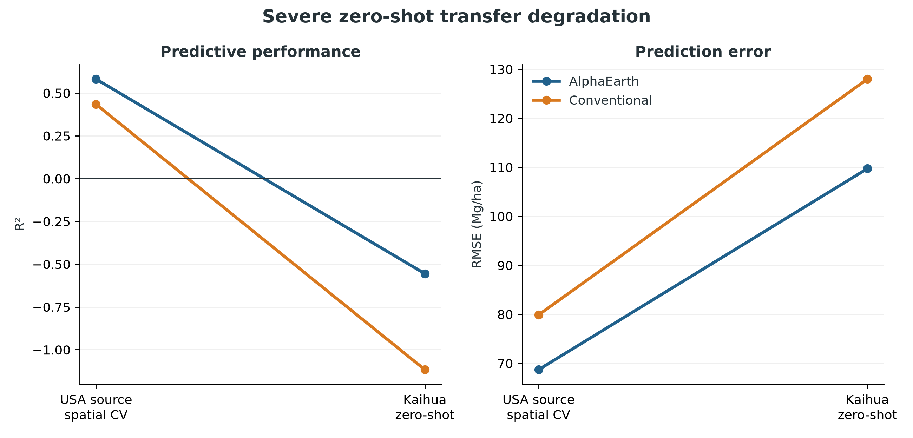

# Cross-Region Forest Biomass Transfer with GEDI and AlphaEarth

A study of whether annual **AlphaEarth** embeddings transfer GEDI L4A
aboveground-biomass relationships from the southeastern United States to eastern
China **better, and with fewer local labels**, than conventional Sentinel-1 /
Sentinel-2 features. The source region is Georgia and South Carolina; the target
is Kaihua County, Zhejiang.

## Overview

GEDI provides globally distributed footprint estimates of forest structure and
aboveground biomass density (AGBD), but its sampling is sparse. Continuous
Earth-observation predictors can extend relationships learned at GEDI footprints,
yet it is unclear whether those relationships remain valid across major
geographic and ecological shifts.

This project asks a single, narrow question:

> Do AlphaEarth embeddings transfer GEDI biomass relationships from the
> southeastern United States to Kaihua County, China, better—and with fewer
> local labels—than conventional Sentinel-1/Sentinel-2 features?

The work separates three questions that are often conflated: **source-domain
prediction**, **direct geographic transfer**, and **target-domain label
efficiency**. AlphaEarth improved the first and third, but severe USA-to-Zhejiang
domain shift prevented reliable zero-shot prediction, so the project reports a
restricted positive result rather than an operational map.

## Key results

All values are frozen and reproduced from `outputs/tables/` and
`outputs/manifests/`. Different rows use different evaluation settings and should
not be compared as if they were the same experiment.

| Experiment (口径) | AlphaEarth + DEM | Conventional + DEM |
|---|---:|---:|
| USA source 50 km block-CV R² | 0.581 | 0.434 |
| USA source 50 km block-CV RMSE (Mg/ha) | 68.70 | 79.88 |
| Kaihua zero-shot R² (labels locked) | −0.556 | −1.117 |
| Labels to first positive local-model R² | 250 | 500 |
| Kaihua local-model R² at 2,500 labels | 0.131 ± 0.017 | 0.059 ± 0.011 |

The zero-shot rows are a **negative result**: both frozen USA models failed in
absolute terms on the target. AlphaEarth kept a consistent relative advantage, and
required fewer target labels to recover positive spatial-holdout performance, but
**no method reached mean R² = 0.20**, so this is not an operational biomass map.

## Main figure







## Method

- **Study areas.** Source: Georgia and South Carolina (consistent state
  boundaries). Target: Kaihua County, Zhejiang (administrative code 330824),
  frozen before evaluation.
- **Data.** GEDI L4A AGBD (2019–2024); AlphaEarth `GOOGLE/SATELLITE_EMBEDDING/V1/
  ANNUAL` (A00–A63); Sentinel-1 GRD and Sentinel-2 SR Harmonized; Copernicus
  GLO-30 DEM. GEDI L4A AGBD is the downstream response product, not field truth.
- **Feature construction.** AlphaEarth: exact-year central 10 m pixel.
  Conventional: exact-year annual-median Sentinel-1/Sentinel-2 plus DEM. Longitude
  and latitude are metadata only, never predictors.
- **Sampling & validation.** Source: 50 km spatial blocks, block × year strata,
  deterministic seed 42, cap 200 per stratum, no AGBD balancing, no
  target-informed sampling → 124,303 common samples after DEM masking. Target:
  five 5 km spatial folds, shared label draws, seeds 42–44.
- **Models.** Identical restricted source-only XGBoost depth-6 tuning budget for
  both representations; target model selection forbidden.
- **Evaluation metrics.** R², RMSE, MAE, Bias (Mg/ha); domain diagnostics
  (PCA, logistic classifier AUROC, nearest-embedding distance vs error).

Full detail: [`docs/methodology.md`](docs/methodology.md),
[`docs/experiments.md`](docs/experiments.md),
[`docs/validation.md`](docs/validation.md), and
[`docs/research_report.md`](docs/research_report.md).

## Experiments

1. **Source-domain CV** — AlphaEarth improved source R² by 0.147 and cut RMSE
   ~14% versus conventional features.
2. **Zero-shot transfer** — both representations degraded severely (R² −0.556 and
   −1.117); neither frozen USA model gave reliable absolute target prediction.
3. **Domain shift** — near-perfect source/target separability (AUROC 1.000) in
   embedding space; nearest-source distance barely explained within-Kaihua error
   (Spearman ρ = 0.022).
4. **Few-shot adaptation** — AlphaEarth first reached positive mean R² with 250
   Kaihua labels vs 500 for conventional; at 2,500 labels R² was 0.131 vs 0.059.

The negative zero-shot result is reported, not hidden.

## Repository structure

```text
gedi-alphaearth-biomass/
├── README.md
├── LICENSE
├── CITATION.cff
├── requirements.txt / environment.yml
├── config.yaml                 # frozen experiment configuration
├── src/                       # extraction, auditing, modelling, figures
├── figures/                   # publication-style result figures
├── outputs/
│   ├── tables/                # frozen result & audit tables (CSV)
│   └── manifests/             # frozen designs, folds, label draws, checksums
├── docs/
│   ├── methodology.md
│   ├── experiments.md
│   ├── validation.md
│   ├── project_summary.md
│   └── research_report.md     # full synthesis
└── data/
    └── README.md              # data sources, licensing, how to obtain
```

## Reproducing the workflow

```bash
git clone https://github.com/raccoon663/gedi-alphaearth-biomass.git
cd gedi-alphaearth-biomass
python -m venv .venv && source .venv/bin/activate
pip install -r requirements.txt
```

The **result tables, figures, and frozen manifests are included**, so the
conclusions can be inspected without any download. Re-running the pipeline end to
end requires:

- a Google Earth Engine account (`earthengine authenticate`); the extraction
  scripts call `ee.Initialize()` and reference only public asset IDs;
- the public datasets listed in `config.yaml` and `data/README.md`;
- local inputs under `data/` (e.g. the Kaihua AOI geojson), which are not
  committed.

Run the extraction, freeze, and modelling scripts in `src/` in the order described
in `docs/methodology.md` and `docs/experiments.md`. Deterministic seeds and the
frozen manifests reproduce the exact sample draws and folds.

## Data availability

Raw and processed remote-sensing data are **not** in this repository (volume,
redistribution terms, Earth-Engine workflow). See
[`data/README.md`](data/README.md) for dataset names, time spans, sources,
licensing posture, and how to regenerate local inputs. Target validation uses GEDI
L4A footprint estimates, not independent field plots; no restricted or third-party
data is distributed here.

## Limitations

- GEDI L4A is not field-measured biomass truth; target evaluation also uses GEDI
  L4A. No independent Chinese field plots were available.
- AlphaEarth pretraining includes GEDI L2A relative-height information — GEDI-derived
  structural provenance overlap, not direct downstream AGBD label leakage.
- 5 km target block CV reduces but does not eliminate ecological dependence among
  neighbouring blocks.
- Only one source geography and one Chinese target region were tested.
- Few-shot adaptation used one fixed lightweight model, not extensive target
  hyperparameter search.
- Absolute Kaihua performance remained too weak for a reliable operational biomass
  map; wall-to-wall mapping was not pursued.

## Citation / contact

No formal publication is associated with this project yet. If you use the code or
results, please cite the repository (see `CITATION.cff`). Author contact details
are omitted from the public repository; add them locally before release.
