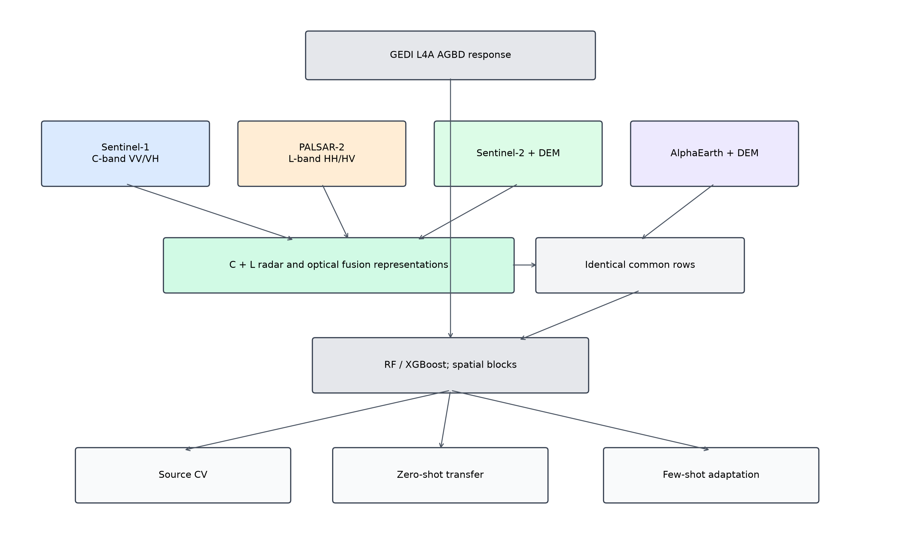
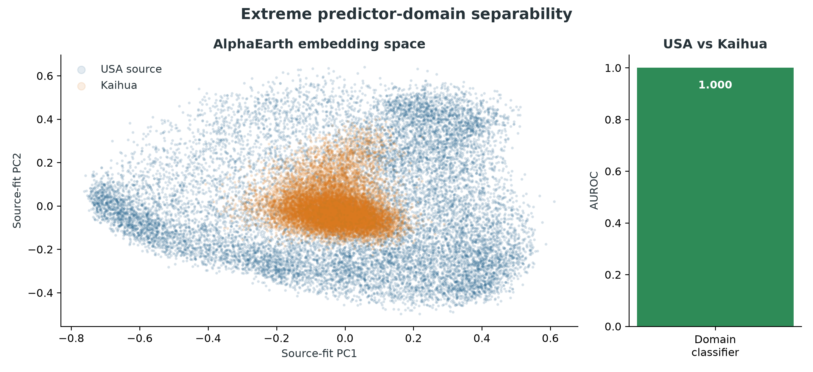
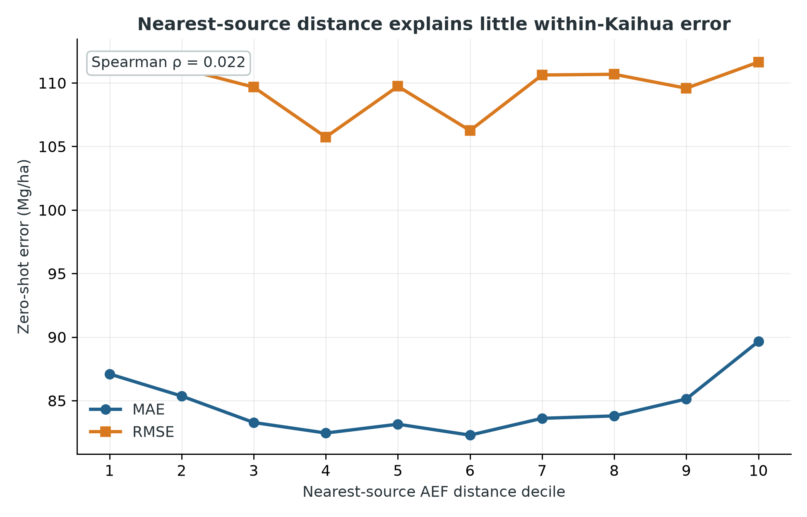
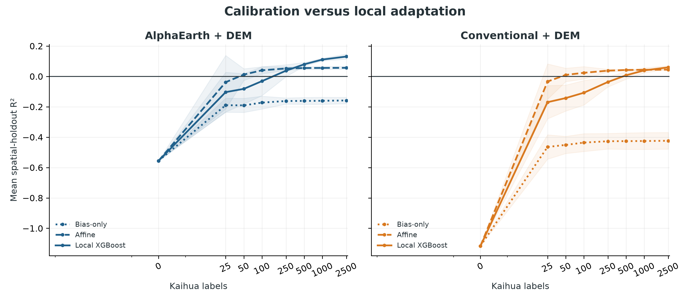

# GEDI Biomass Transfer across Foundation, C-band and L-band Representations

> Version-2 adds a PALSAR-common paired benchmark. Numerical conclusions below
> remain the legacy frozen experiment unless explicitly labelled PALSAR.

## 1. Motivation

GEDI provides globally distributed footprint measurements and model-based estimates of forest structure and aboveground biomass density (AGBD), but its sampling is spatially sparse. Continuous Earth-observation predictors can potentially extend relationships learned at GEDI footprints, yet it is unclear whether those relationships remain valid across major geographic and ecological shifts.

This project asks whether AlphaEarth annual embeddings provide stronger geographic transfer than conventional Sentinel-1/Sentinel-2 predictors. It distinguishes source-domain accuracy from direct zero-shot transfer and target-domain label efficiency. The source region is Georgia and South Carolina in the southeastern United States; the target is Kaihua County, Zhejiang, eastern China.

## 2. Study regions

The source domain combines Georgia and South Carolina, defined from consistent state boundaries and used exclusively for source sampling, representation selection and source-model development. Kaihua County (administrative code 330824) is the sole target. Its vetted boundary was frozen before target analysis and protected by SHA-256 provenance records.

The design intentionally creates a difficult transfer setting: a model trained in the southeastern United States is applied to an eastern Chinese forest landscape without using target labels until after zero-shot predictions are frozen.

## 3. Data

- **GEDI L4A V2.1:** footprint-level AGBD response and quality fields for 2019–2024.
- **AlphaEarth:** `GOOGLE/SATELLITE_EMBEDDING/V1/ANNUAL`, bands A00–A63.
- **Sentinel-1:** `COPERNICUS/S1_GRD`, annual median VV and VH in dB, both orbit directions pooled, plus VV−VH.
- **Sentinel-2:** `COPERNICUS/S2_SR_HARMONIZED`, scaled reflectance with frozen SCL+QA60 masking, ten bands and five indices.
- **Topography:** `COPERNICUS/DEM/GLO30`, elevation, slope, sine aspect and cosine aspect.

GEDI L4A AGBD is treated as the downstream response product, not as field-measured biomass truth.

## 4. Source sampling

Source GEDI footprints were assigned to 50 km × 50 km blocks in EPSG:5070 before sampling. Strata were spatial block × year, with deterministic random selection, seed 42 and a cap of 200 QA-valid footprints per stratum. Strata below the cap were retained completely; there was no oversampling, AGBD quantile balancing or target-dependent resampling.

The frozen source manifest contains 127,622 footprints. After the frozen DEM mask, both representation branches use the identical ordered common set of 124,303 samples. Five folds were mapped strictly at block level so that no source block crosses train/test partitions.

## 5. Representation construction

The AlphaEarth branch contains A00–A63 plus four DEM variables. Annual embeddings use the exact footprint year and the central 10 m pixel, without nearest-year substitution or target-specific renormalization.

The conventional branch contains Sentinel-1 VV, VH and VV−VH; ten Sentinel-2 bands; NDVI, EVI, NDMI, NBR and NDRE; and the same four DEM variables. All optical and radar predictors use the exact calendar year and frozen annual-median temporal rule in both domains.

Longitude and latitude are metadata only and are never model predictors.

## 6. AlphaEarth aggregation decision

A source-only development subset compared the central 10 m pixel with a 25 m component-wise mean followed by L2 renormalization. The two methods were practically equivalent under a predeclared source block-CV rule: central mean R² was 0.56735 and aggregate-25 mean R² was 0.56597, with a relative RMSE difference of 0.156%. The rule therefore selected the less expensive central-pixel method before full extraction and before any Zhejiang evaluation.

## 7. Source-domain results

The final comparison used identical source footprints and five 50 km block folds. Model selection used an identical restricted source-only tuning budget for both representations; the winning configuration per representation was chosen by nested spatial cross-validation.

| Representation | R² | RMSE (Mg/ha) | MAE (Mg/ha) | Bias (Mg/ha) |
|---|---:|---:|---:|---:|
| AlphaEarth + DEM | 0.5761 | 69.11 | 42.23 | +1.08 |
| Conventional + DEM | 0.4251 | 80.49 | 53.48 | +1.09 |

AlphaEarth improved source R² by 0.151 and reduced RMSE by approximately 14% relative to conventional predictors.

## 8. Zero-shot transfer

Target labels remained locked during Kaihua predictor construction and model prediction. DEM, AlphaEarth and conventional variables were extracted for the exact same 130,195 target footprints. The two frozen prediction files were hashed before AGBD and AGBD-SE were unlocked and joined by shot number.

| Representation | R² | RMSE (Mg/ha) | MAE (Mg/ha) | Bias (Mg/ha) |
|---|---:|---:|---:|---:|
| AlphaEarth + DEM | -0.5556 | 109.72 | 84.58 | +55.68 |
| Conventional + DEM | -1.1166 | 127.98 | 100.41 | +73.59 |

Both representations suffered severe transfer degradation and large positive bias. AlphaEarth remained relatively better on every primary metric and had a smaller R² drop, but negative target R² means that zero-shot transfer did not succeed in an absolute predictive sense.

## 9. Domain shift

Predictor-only diagnostics were completed without changing the source models. A source-fit PCA shows strong displacement between AlphaEarth embeddings from the USA and Kaihua. A standardized logistic domain classifier achieved AUROC 1.000, indicating extreme domain separability.

This separability is descriptive, not a target-model selection rule. It also does not imply that classifier probability predicts sample-level biomass error. Exact nearest-source Euclidean embedding distance had only a negligible association with within-Kaihua absolute zero-shot error (Spearman ρ = 0.022).

## 10. Few-shot adaptation

Kaihua footprints were first assigned to 117 fixed 5 km × 5 km grid cells in EPSG:32650, and entire cells were then assigned to five sample-balanced spatial folds (~26,000 evaluation footprints each) so that no cell crosses a train/test partition. Label budgets were 25, 50, 100, 250, 500, 1,000 and 2,500, with seeds 42–44. Every fold × budget × seed used the identical target shot-number draw for both representations, without AGBD stratification or active learning.

Three adaptation methods were tested: an intercept-only bias correction, two-parameter affine calibration and a shared conservative local XGBoost configuration frozen before representation results. Bias-only calibration remained negative at every budget, demonstrating that failure was not a simple offset. Affine calibration became slightly positive with 50 labels but plateaued near R² 0.05, indicating both offset and scale mismatch.

Local AlphaEarth models first achieved positive mean spatial-holdout R² with 250 labels; conventional models required 500. At 2,500 labels, AlphaEarth reached R² 0.1306 ± 0.0168 and RMSE 81.90 Mg/ha, compared with R² 0.0594 ± 0.0105 and RMSE 85.19 Mg/ha for conventional features. No method reached mean R² 0.2.

## 11. Main findings

1. AlphaEarth substantially improved source-domain GEDI AGBD prediction relative to conventional Sentinel features.
2. Both representations suffered severe USA-to-Kaihua zero-shot degradation; neither frozen USA model provided reliable absolute target prediction.
3. AlphaEarth retained stronger relative zero-shot performance.
4. AlphaEarth required fewer Kaihua labels to recover positive mean spatial-holdout R² and remained stronger at every tested local-model budget.
5. Absolute few-shot performance remained too weak for reliable operational biomass mapping.

The restrained main conclusion is:

> AlphaEarth embeddings substantially improved source-domain GEDI biomass prediction and retained stronger relative performance under severe USA-to-Zhejiang geographic transfer. Although direct zero-shot prediction failed for both representations, AlphaEarth required fewer target-domain labels to recover positive spatial-holdout performance, indicating stronger representation-level label efficiency under domain shift.

However, absolute Kaihua performance remained modest, and the tested models do not support a reliable operational biomass map.

## 12. Limitations

- GEDI L4A is not field-measured biomass truth; target evaluation also uses GEDI L4A.
- AlphaEarth pretraining incorporates GEDI L2A relative-height information. This is GEDI-derived structural provenance overlap, not direct downstream AGBD label leakage.
- Five-kilometre target block CV reduces local footprint leakage but does not guarantee complete ecological independence among neighboring blocks.
- Only one source geography and one Chinese target region were evaluated.
- Few-shot adaptation intentionally used one fixed lightweight model rather than extensive target hyperparameter search.
- No independent Chinese field plots were available.
- The source and target GEDI sampling patterns may not represent every forest condition in either region.

## 13. Conclusion

AlphaEarth provides a better representation for source-domain biomass prediction and a measurable target-domain label-efficiency advantage under severe geographic shift. The experiment also shows why source accuracy must not be equated with geographic transfer: both frozen source models failed zero-shot, and even 2,500 local labels recovered only modest spatial-holdout performance. The project therefore answers its representation-transfer question without presenting itself as a successful operational mapping system. Formal Kaihua wall-to-wall biomass mapping was not pursued.

## 14. Radar wavelength benchmark extension

The extension asks whether PALSAR-2 L-band, Sentinel-1 C-band, fusion and optical
counterparts differ in source prediction, USA→Kaihua transfer and target label
efficiency. Exact-year matching and one identical PALSAR-common sample prevent
legacy full-sample metrics from entering the paired table. A wall-to-wall product
remains gated on stable positive target spatial-holdout performance—preferably
R² ≥ 0.20 without catastrophic bias—and would be described only as a
GEDI-calibrated biomass prediction.

### 14.1 Completed radar results

The PALSAR-common set contains 109,830 source and 107,809 target footprints from
all years 2019–2024. A direct QA audit established that JAXA v2.4 class 1 is
ScanSAR land and that the Earth Engine catalog omits the 1–4 ScanSAR classes.
It also found that `mosaic()` discarded the native default projection despite one
image per year; direct `first()` extraction and `qa in {1,255}` were therefore
used. Thus 2023 is included without nearest-year substitution. PALSAR_L modestly
outperformed S1_C in source CV (R² 0.296 versus 0.283), and C+L fusion improved
to 0.347. AlphaEarth remained strongest at 0.574. The optical-controlled source
comparison was effectively tied (PALSAR+S2 0.419; S1+S2 0.421).

PALSAR masking reduced 124,303 source rows to 109,830 and 130,195 target rows to
107,809. The aggregate selection audit showed a +0.75 Mg/ha source-mean and
−3.22 Mg/ha target-mean AGBD shift; year/block total-variation distances were
0.046/0.047 for source and 0.0066/0.0179 for target. These shifts were judged
small and no rebalancing was introduced.

No source model achieved positive Kaihua zero-shot R². PALSAR+S2 was least poor
(−0.297; RMSE 99.15 Mg/ha). PALSAR_L reached −0.596 versus S1_C at −0.718,
while C+L reached −0.513; these are relative reductions in failure, not successful
transfer. Full fusion transferred poorly at −1.104 despite its source gain. Domain
classifiers remained essentially saturated (AUROC 0.99984–1.0000), so PALSAR did
not materially erase the USA–China predictor shift.

At the highest local-label budget, AlphaEarth remained best (R² 0.142 ± 0.020),
followed by full conventional fusion (0.071 ± 0.010), S1+S2 (0.070 ± 0.010),
and PALSAR+S2 (0.067 ± 0.009). High-biomass-bin RMSE was 155.12 for S1_C,
155.13 for PALSAR_L and 150.31 Mg/ha for C+L; this small fusion advantage does
not establish a formal saturation threshold. Within-bin interpretation emphasizes
RMSE, bias, median residual and residual IQR. Within-bin R² is secondary: it is
unstable and difficult to interpret because each bin has deliberately restricted
response variance. Wall-to-wall mapping was withheld.

### Radar benchmark limitations

The C-versus-L comparison is not an isolated wavelength experiment: Sentinel-1
uses VV/VH while PALSAR uses HH/HV, temporal composition and sensor geometry also
differ, and PALSAR is distributed as a yearly mosaic product. PALSAR validity
masking reduces the identical-row common sample and can introduce selection.
GEDI L4A is the response product rather than independent field biomass. Strong
source-target separability persists under every representation, and nearest-source
representation distance is weak or negative for several radar branches, so it is
not a universal sample-level error proxy. No reliable zero-shot operational map
was achieved.
